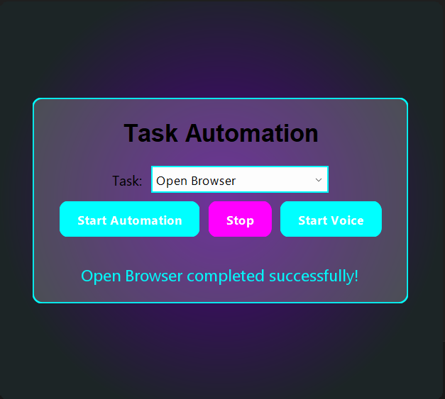

# TaskAutomation

**TaskAutomation** is a Java-based desktop application that automates common tasks such as opening applications and performing basic operations using keyboard simulation. It features a modern, glassmorphic UI with particle animations and voice command simulation (via dialog input).

![TaskAutomation UI Preview]
 <!-- Optional: Add a screenshot if available -->

---

## ✨ Features

### 🚀 Task Automation
Automate tasks like:
- **Open Notepad:** Launches Notepad and types/saves a timestamped note.
- **Open Browser:** Opens Google in the default web browser.
- **Open Explorer:** Opens the Documents folder in File Explorer.
- **Open Outlook:** Opens a new email draft in the default email client.

### 🎙️ Voice Command Simulation
Simulates voice control through a dialog box. Supported commands:
- `open notepad`
- `open chrome`
- `open explorer`
- `open outlook`

### 🎨 Modern UI
- Glassmorphic design with rounded corners and a radial gradient background.
- Particle animations for aesthetic appeal.
- Glowing buttons with hover and click effects.
- Borderless, draggable window.

### 📢 Feedback System
- **Status Feedback:** Animated messages with fade-in and error shake effects.
- **Sound Feedback:** Uses `Toolkit.getDefaultToolkit().beep()` for basic sounds.

---

## 💻 Requirements

- **JDK Version:** Java 8 or higher  
- **Operating System:** Windows only  
- **Dependencies:** No external libraries, only standard Java (`javax.swing`, `java.awt`, etc.)

---

## 🛠️ Installation

```bash
# Clone the repository
git clone https://github.com/srikanthramagani/TaskAutomation.git

# Navigate into the project directory
cd TaskAutomation

# Compile the program
javac TaskAutomation.java

# Run the application
java TaskAutomation
